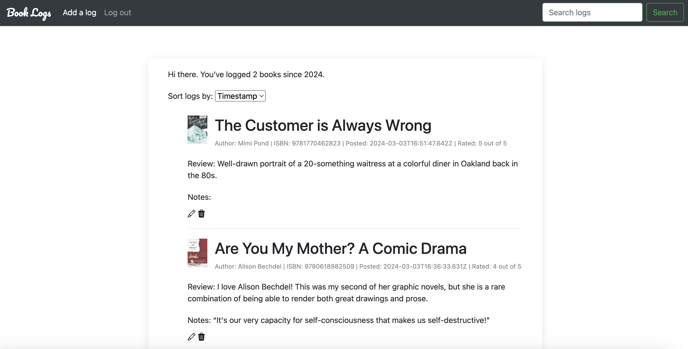

# Book Log

## Table of Contents
* [Description](#description)
* [Installation](#installation)
* [File Tree](#file-tree)

## Description
Book Log is a web app that allows users to update, view, and search the book logs for the books they have read. 

**Features include:**
- A user can:
    - Register with email and password as well as through Google
    - Once logged in: 
      - See a full list of books they have logged in the homepage along with book covers from https://openlibrary.org/dev/docs/api/covers
      - Add, edit, and delete book logs, which may include a rating, review, and book notes  
      - Search book logs
      - Sort book logs by date added, title, and ratings

This project is designed and implemented using Node.js, Express.js, Axios, EJS, CSS and Bootstrap. PostgreSQL is used to persist user data. 

## Installation
  1. `$ git clone https://github.com/connieqian/Book-Log.git`
  2. `$ npm i`
  3. Create a local postgreSQL database using queries in `schema.sql`
  4. Update environment variables
  5. `$ node book-notes-api.js` in one terminal
  6. `$ node index.js` in a different terminal

## File Tree 
- `book-notes` - Main directory
    - `public\styles` 
        - `main.css` - Styles for all HTML files
        - `main.js` - JavaScript file which includes functions to expand notes
    - `views` - Holds all HTML files
        - `partials\header.ejs` - Header page
        - `partials\header_w_navbar.ejs` - Header page with a navigation bar
        - `partials\footer.ejs` - Footer page
        - `home.html` - Main page before a user signs in
        - `register.html` - Registration page
        - `login.html` - Login page
        - `logs.html` - Displays a user's book logs with sort and search features
        - `submit.html` - Create or edit a new book log 
    - `index.js` - Renders all pages
    - `book-notes-api.js` - API to GET, POST, PUT, and DELETE log(s)
    - `schema.sql` - PostgreSQL queries used
